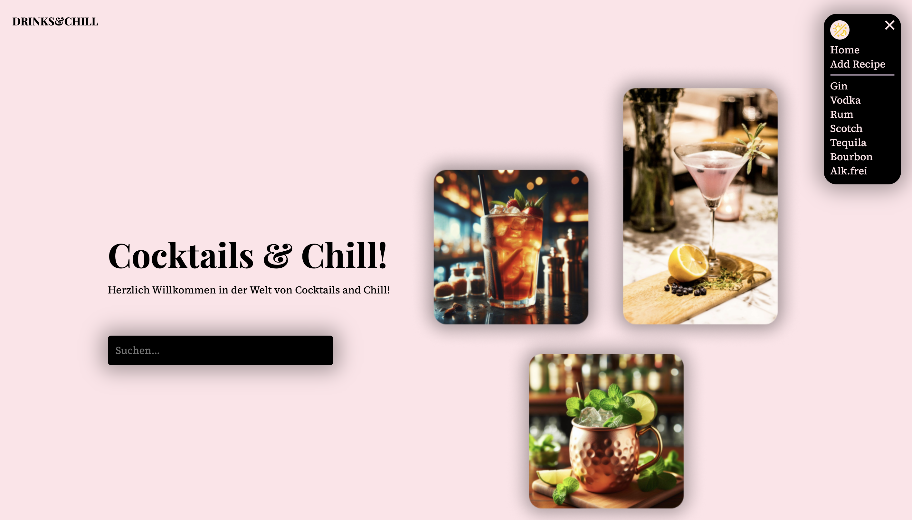

# Frontend-Project: CocktailApp

## How does CocktailApp work? ⚙️

The CocktailApp allows you to search for the right drinks for your next party. You can also add your own creations. If you are short of ideas, you can have random drinks suggested to you

- search for cocktails by name
- select and filter between categories
- random cocktail suggestion
- show recipes with instructions and ingredients for the cocktails
- add your own recipes
- dark light mode

## Screenshots 📸

## Copatible Screensizes 🖥️

- optimized for Desktops
- optimized for Tablet
- optimized for Mobile

## Tech Stack 💻

- React.js
- Vite
- VS Code
- HTML
- CSS
- JavaScript
- Git
- Trello
